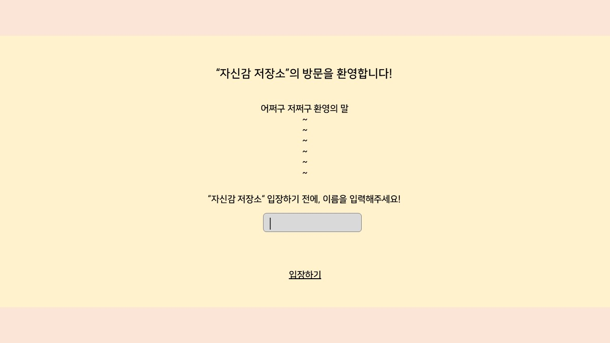
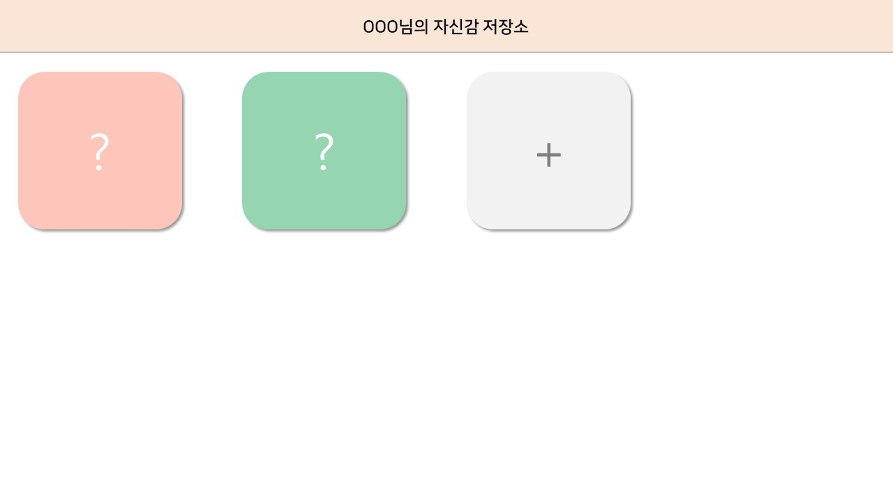
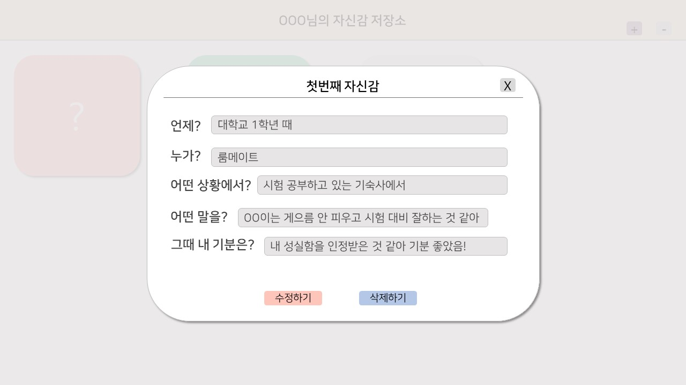
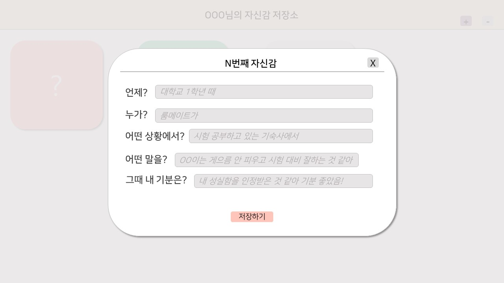

# 자신감 저장소(Courage Storage) 프로젝트
- 칭찬이나 자신감을 북돋아주는 말을 들었을 때 저장해놓는 사이트
  
# 설계
## 사용
| 구분 | 사용 |
|:---:|:---:|
|Lang|Typescript|
|Library|React, Redux|
|CSS Framework|Tailwind|

## 프로토타입 및 기능
### Welcome 페이지

- 사용자 이름 입력받기
- '입장하기' 클릭 시, 홈페이지로 이동

### Homepage

- 헤더 : 웰컴페이지에서 입력받은 사용자 이름 출력
- '+' 버튼 누르면 모달창 생성
- 이미 생성된 아이템 클릭 시 내용 확인 가능
- 아이템 호버링 시 확대 모션
- 생성되는 아이템의 색은 무작위로 선정
- 아이템 생성된 순서대로 id 넘버링
- 아이템 생성시, 앞에서부터 추가
- 화면 사이즈에 따라 아이템 위치 변화

### View-Item

- 새로운 모달창으로 내용 확인
- '수정하기' 클릭시, 내용 수정 가능
- '삭제하기' 클릭시, 알림창으로 삭제의사 확인 후 삭제
- 우측 상단의 'X'버튼 누르면 창 닫기

### Add-Item

- 새로운 모달창으로 내용 추가
- 헤더의 N은 마지막 아이템 id+1
- placeholder로 예시 문구 지정
- '저장하기' 클릭시, 입력 내용 저장 및 홈페이지에 새로운 아이템 추가